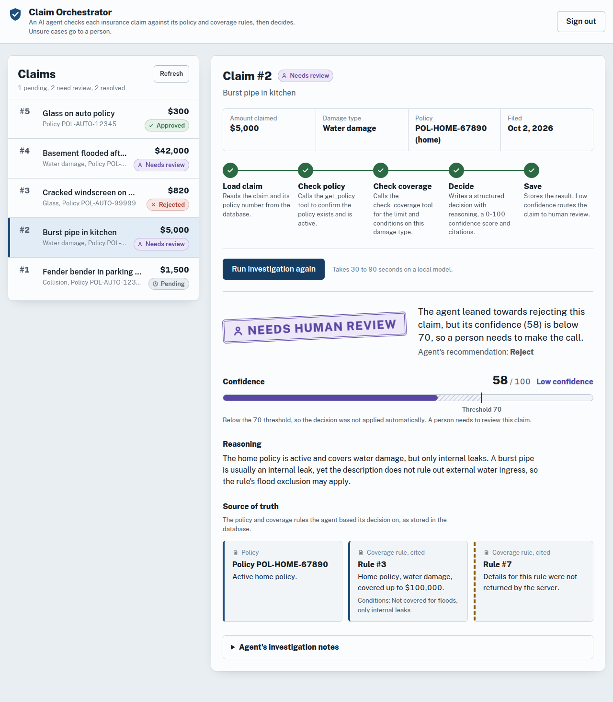
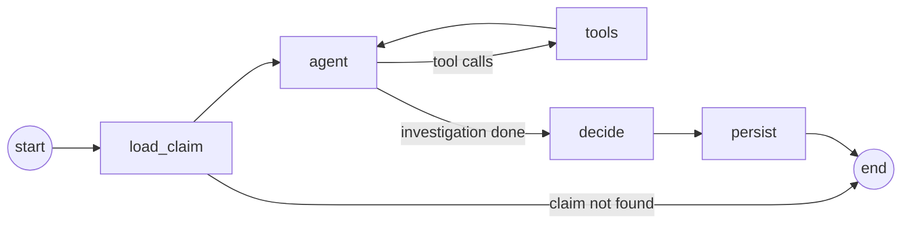
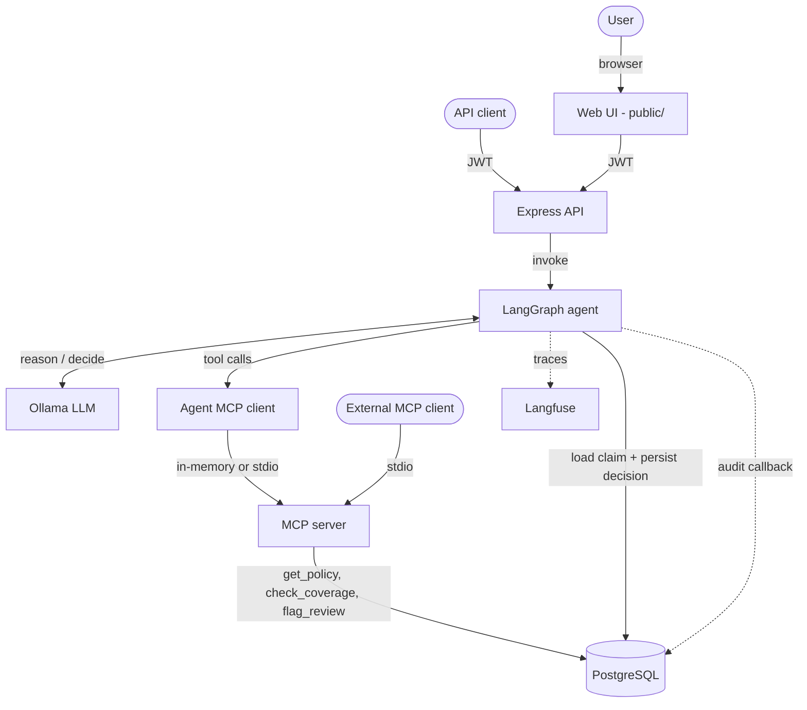
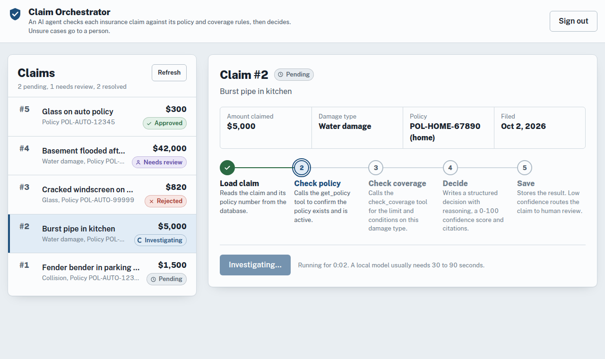
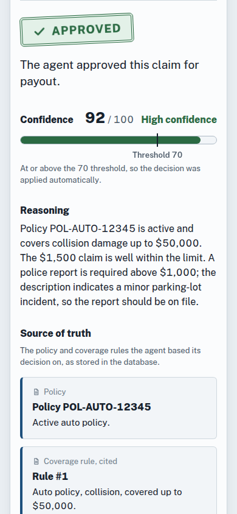

# Agentic Insurance Claim Orchestrator

An AI agent that investigates insurance claims. It reads the claim, checks the policy and coverage rules, and makes a decision you can audit: every decision cites the exact policy and coverage rules it relied on and carries a 0-100 confidence score. If the agent is not confident enough, the claim goes to a human reviewer instead of being resolved automatically.

Built with **LangGraph.js**, a **local LLM via Ollama**, **PostgreSQL**, the **Model Context Protocol (MCP)**, **Langfuse** tracing and a JWT-secured **Express** API with a web console.



## Highlights

- **Structured, cited decisions.** The LLM must return `approve` / `reject` / `flag`, a reasoning text, a confidence score and citations. All of it is validated with Zod. Citations are checked against what the tools actually returned, so made-up IDs are dropped.
- **Human-in-the-loop.** A decision below `CONFIDENCE_THRESHOLD` (default 70) is stored as `needs_human_review`. Malformed LLM output falls back to human review too.
- **Source of truth.** The API resolves cited IDs into the full policy and coverage-rule rows, and the UI shows them as readable cards.
- **Audit trail.** Every node, LLM call and tool call goes into an append-only `audit_logs` table; a DB trigger rejects UPDATE and DELETE.
- **Runs locally.** Ollama is the default model provider. Gemini, Anthropic and OpenAI can be switched in with one env var.
- **Tested.** Jest unit tests across the graph nodes, MCP tools, repositories and routes, plus E2E evals against a real Postgres. CI runs lint, type check, unit and E2E on every PR.

## How it works

### The agent graph



| Node | What it does |
| --- | --- |
| `load_claim` | Loads the claim and its policy number from Postgres. Ends the run if the claim does not exist. |
| `agent` | The LLM investigates, calling `get_policy` and `check_coverage` as needed. The investigation is read-only. |
| `tools` | Runs the requested tools on the MCP server (`src/mcp/tools/`), which reads the database. |
| `decide` | Asks the LLM for a structured `ClaimDecision` (`withStructuredOutput` + Zod), then keeps only citations the tools really returned. |
| `persist` | Applies the confidence threshold and writes the final status and decision to the `claims` row. |

### System overview



The MCP server (`src/mcp/`) is the only implementation of the agent's tools. The agent has no tool code of its own: its MCP client (`src/agent/mcp_client.ts`) connects to the server, converts the server's tools into LangChain tools with `@langchain/mcp-adapters`, and binds only the read-only ones (`get_policy`, `check_coverage`). External MCP clients reach the same server over stdio, and they also get `flag_review`. Outside of tool calls, the graph uses the repositories in `src/db/` to load the claim and to persist the final decision.

## Tech stack

| Area | Choice |
| --- | --- |
| Language | TypeScript (strict), Node.js 20 |
| Agent framework | LangGraph.js, LangChain |
| LLM | Ollama (`llama3.1` / `gemma2`) by default. Gemini, Anthropic and OpenAI are optional. |
| Tool protocol | Model Context Protocol (`@modelcontextprotocol/sdk`) |
| Database | PostgreSQL 15 (Docker), PgAdmin |
| API / UI | Express, JWT (HS256). Plain HTML/CSS/ES-module UI with no build step. |
| Observability | Langfuse, structured logger, audit table |
| Testing / CI | Jest, Supertest, GitHub Actions |

## Quick start

### Prerequisites

- [Docker & Docker Compose](https://docs.docker.com/get-docker/)
- [Node.js](https://nodejs.org/en/) 20 or 22
- [Ollama](https://ollama.com/) running locally

### 1. Configure

```bash
cp .env.example .env
# Edit .env: set JWT_SECRET, AUTH_USERNAME and AUTH_PASSWORD (the app will not start with them missing)
ollama pull llama3.1
```

When the app runs in Docker it reaches Ollama on your host through `OLLAMA_BASE_URL` (`http://host.docker.internal:11434` by default).

### 2. Start the stack

```bash
make build      # docker-compose up -d --build: Postgres, PgAdmin and the app
```

### 3. Create the schema and demo data

```bash
npm install
make db-seed    # creates the tables and inserts demo policies, coverage rules and claims
```

`make db-seed` runs from your machine against `DB_HOST`/`DB_PORT` in `.env` (`localhost:5432`, which Docker Compose exposes). It **truncates** the tables first.

### 4. Use it

- Web UI: <http://localhost:3000>. Sign in with `AUTH_USERNAME` / `AUTH_PASSWORD`.
- PgAdmin: <http://localhost:5050>.
- API: see [API reference](#api-reference).

The demo data has an auto collision claim (#1) and a home water-damage claim (#2), both `pending`.

## Configuration

All settings come from `.env` (see [`.env.example`](.env.example)).

| Variable | Required | Default | Purpose |
| --- | --- | --- | --- |
| `JWT_SECRET` | yes | none | Secret for signing and verifying JWTs (HS256). Use a long random value. |
| `JWT_EXPIRES_IN` | no | `1h` | Token lifetime: seconds or a duration (`15m`, `1h`, `7d`). |
| `AUTH_USERNAME` / `AUTH_PASSWORD` | yes | none | Credentials accepted by `POST /login`. |
| `DB_HOST`, `DB_PORT`, `DB_USER`, `DB_PASSWORD`, `DB_NAME` | yes (Docker) | `localhost`, `5432`, `postgres`, `postgres`, `insurance_db` | Postgres connection. The Postgres container also uses them to create its user and database. |
| `DATABASE_URL` | no | none | Full connection string; used instead of the `DB_*` values when set (CI, Docker). |
| `LLM_PROVIDER` | no | `ollama` | `ollama`, `gemini`, `anthropic` or `openai`. Cloud providers read their usual API-key variables. |
| `LLM_MODEL` | no | `llama3.1` | Model name for the chosen provider. |
| `OLLAMA_BASE_URL` | no | `http://localhost:11434` | Where Ollama is reachable. |
| `CONFIDENCE_THRESHOLD` | no | `70` | Decisions with a lower `confidence_score` (0-100) go to `needs_human_review`. |
| `MCP_TRANSPORT` | no | `inmemory` | How the agent reaches the MCP server: `inmemory` (in-process) or `stdio` (spawns the compiled server). See [MCP server](#mcp-server). |
| `MCP_SERVER_PATH` | no | `dist/mcp/server.js` | Compiled server entry point spawned when `MCP_TRANSPORT=stdio`. |
| `LANGFUSE_PUBLIC_KEY` / `LANGFUSE_SECRET_KEY` | no | none | Enables Langfuse tracing when both are set. |
| `LANGFUSE_BASEURL` | no | `https://cloud.langfuse.com` | Langfuse host, e.g. a self-hosted instance. |
| `PGADMIN_EMAIL` / `PGADMIN_PASSWORD` | yes (Docker) | none | PgAdmin login. |
| `PORT` | no | `3000` | API port. |

## Make commands

| Command | What it does |
| --- | --- |
| `make up` | Start the Docker stack. |
| `make build` | Rebuild and start the Docker stack. |
| `make down` | Stop the stack. |
| `make clean` | Stop the stack, **delete the database volume**, and remove `dist/` and `node_modules/`. |
| `make logs` | Follow container logs. |
| `make db-seed` | Create the tables and reset the demo data. |
| `make test` | Run the unit tests. |
| `make test-e2e` | Build, then run the E2E evals (needs Postgres; the LLM is mocked). |

## API reference

Every endpoint except `/login` needs an `Authorization: Bearer <token>` header and returns `401` without a valid, unexpired token. Errors always have the shape `{ "error": string }`.

| Method & path | Purpose |
| --- | --- |
| `POST /login` | `{ username, password }` → `{ token }`. Returns `400` for a malformed body and `401` for wrong credentials. |
| `GET /claims` | `{ claims: ClaimSummary[] }`, ordered by `id`. |
| `GET /claims/:id` | One `ClaimSummary`. Returns `400` for an invalid id and `404` if the claim is not found. |
| `POST /claim` | `{ claim_id }`: runs the agent and returns a `ClaimResolutionResponse`. |
| `GET /claims/:id/audit` | The audit trail of the claim's runs. |

```bash
TOKEN=$(curl -s -X POST localhost:3000/login -H 'Content-Type: application/json' \
  -d '{"username":"<AUTH_USERNAME>","password":"<AUTH_PASSWORD>"}' | jq -r .token)

curl localhost:3000/claims -H "Authorization: Bearer $TOKEN"
curl -X POST localhost:3000/claim -H "Authorization: Bearer $TOKEN" \
  -H 'Content-Type: application/json' -d '{"claim_id":1}'
```

The API and the MCP server share one auth module (`src/auth/jwt.ts`). Response types live in `src/api/types.ts`.

### Claim decisions

`POST /claim` returns a structured, cited decision:

```json
{
  "claim_id": 1,
  "status": "approved",
  "decision": {
    "decision": "approve",
    "reasoning": "Policy POL-AUTO-12345 is active and the 1500 collision claim is within the 50000 limit.",
    "confidence_score": 92,
    "citations": { "policy_id": 1, "policy_number": "POL-AUTO-12345", "coverage_rule_ids": [1] },
    "fallback": false
  },
  "summary": "Investigation complete. ...",
  "claim": {
    "id": 1,
    "policy_number": "POL-AUTO-12345",
    "policy_type": "auto",
    "claim_amount": 1500,
    "damage_type": "collision",
    "status": "approved",
    "description": "Fender bender in parking lot",
    "created_at": "2026-01-02T03:04:05.000Z"
  },
  "sources": {
    "policy": { "id": 1, "policy_number": "POL-AUTO-12345", "status": "active", "type": "auto" },
    "coverage_rules": [
      {
        "id": 1,
        "policy_type": "auto",
        "damage_type": "collision",
        "max_coverage_amount": 50000,
        "conditions": "Requires police report if over $1000"
      }
    ]
  },
  "confidence_threshold": 70
}
```

- `status` is one of `approved`, `rejected`, `flagged` or `needs_human_review`. Any decision with `confidence_score` below the threshold goes to `needs_human_review`.
- `confidence_threshold` is the threshold that was applied to this decision, so clients such as the web UI don't have to guess the configured value.
- Citations only include policy and coverage-rule IDs that the tools actually returned. IDs the model invents are removed.
- If the model returns malformed output, the claim is routed to human review (`decision: "flag"`, `confidence_score: 0`, `fallback: true`).
- `claim` is the claim as stored *after* the decision was saved, so `claim.status` matches `status`.
- `sources` resolves the citations to full rows: the cited policy (by `policy_id`, falling back to `policy_number`) and the cited coverage rules. Cited IDs that do not exist are left out.
- In `ClaimSummary`, `claim_amount` is a number (not the DECIMAL string Postgres returns) and `created_at` is an ISO 8601 string.

## Web UI

Open <http://localhost:3000> and sign in.

1. **Pick a claim** from the list. Each row shows the amount, damage type, policy and a status badge (icon + text, never colour alone).
2. **Run AI investigation.** Five pipeline steps (Load claim, Check policy, Check coverage, Decide, Save) explain what the agent does and animate while it works. A local model usually needs 30-90 s; the button is disabled until the run finishes.
3. **Read the result:**
   - a verdict stamp: Approved, Rejected, Flagged or Needs human review
   - a confidence meter that marks the threshold
   - the reasoning
   - a **Source of truth** section showing the cited policy and coverage rules as plain-language cards
   - the agent's notes, collapsed by default

   The claim's status in the list updates straight away.

| Investigation in progress | Phone width |
| --- | --- |
|  |  |

The UI is plain HTML, CSS and browser ES modules in `public/`, with no framework and no build step. It follows the system light/dark setting and returns to the sign-in screen when the token expires. Presentation logic lives in the DOM-free `public/js/view-model.mjs`, which is unit-tested.

## Observability

- **Langfuse:** when `LANGFUSE_PUBLIC_KEY` and `LANGFUSE_SECRET_KEY` are set, every `POST /claim` run is traced (LLM calls, tool calls, latency).
- **Logs:** `src/utils/logger.ts` writes standard console logs.
- **Audit trail:** each `POST /claim` run attaches an `AuditCallbackHandler` (`src/agent/callbacks/audit/`). It records these events in `audit_logs`:
  - `node_start` / `node_end`
  - `llm_start` / `llm_end`, with messages and tool calls
  - `tool_start` / `tool_end`, with tool name, input and output, plus `mcp_server` / `mcp_transport` showing the call went through MCP
  - `error`

  Writes are queued in event order and flushed before the HTTP response returns. They never fail the claim (errors are only logged), and long strings are truncated.

```bash
curl -H "Authorization: Bearer $TOKEN" http://localhost:3000/claims/1/audit
# => { "claim_id": 1, "count": 8, "entries": [{ "step_index": 0, "event_type": "node_start", "node_name": "load_claim", "payload": {...}, ... }] }
```

## MCP server

`src/mcp/server.ts` builds the MCP server (`createMcpServer()`) with three tools. It is the data-access layer for the agent's investigation and is also available to external MCP clients.

| Tool | Purpose | Bound to the agent |
| --- | --- | --- |
| `get_policy` | Policy details by policy number (JSON row). | yes |
| `check_coverage` | Coverage rule for a policy type and damage type (JSON row). | yes |
| `flag_review` | Flags a claim for review and appends the reason to its description (write). | no |

**How the agent connects.** `src/agent/mcp_client.ts` opens one shared MCP connection on the first claim, loads the server's tools with `@langchain/mcp-adapters`, and keeps only the allow-listed read-only tools. `flag_review` is never bound, because claim status is written only by the `persist` node. `MCP_TRANSPORT` picks the transport:

- `inmemory` (default): a fresh server runs in the API process, linked to the client by the SDK's `InMemoryTransport`. This is the real MCP protocol (`tools/list`, `tools/call`) without a second process.
- `stdio`: the client spawns `node dist/mcp/server.js` (or `MCP_SERVER_PATH`) as a child process with the API's environment, so it uses the same database settings. Run `npm run build` first. The Docker image already contains the compiled server.

The tools return their DB row as JSON text. The `decide` node parses those tool results to verify the decision's citations, so keep that format if you change a tool.

**External clients.** Run the server over stdio and point any MCP client (such as Claude Desktop or the MCP Inspector) at it:

```bash
npx ts-node src/mcp/server.ts    # or: node dist/mcp/server.js
```

**Auth.** The MCP tools do not take a token. Both transports are local: in-memory never leaves the API process, and stdio is a child process that the caller starts itself, so it inherits the caller's trust and environment. This follows the MCP guidance that stdio servers take credentials from the environment. The JWT helpers in `src/mcp/auth.ts` are for a future network transport (Streamable HTTP), where requests must be authenticated.

## Testing

```bash
npm run lint && npx tsc --noEmit
make test        # unit tests: nodes, tools, repositories, routes, auth, audit, UI view model
make test-e2e    # E2E evals against Postgres with a mocked LLM
```

The E2E evals (`src/__tests__/e2e/`) run the whole graph through the HTTP API, with tool calls going through the MCP server to Postgres. They check the final DB state, the human-review routing, citation filtering, the `sources` resolution, the audit trail (including the MCP origin of each tool call) and the stdio transport against the compiled server. **They truncate the tables**, so point `DATABASE_URL` at a throwaway database. CI (`.github/workflows/ci.yml`) runs all of the above against a Postgres service container.

## Project structure

```text
src/
  agent/          LangGraph: graph.ts, state.ts, decision.ts (Zod schema), model.ts (provider switch),
                  mcp_client.ts (MCP tools for the agent), config.ts (threshold), prompts.ts,
                  nodes/, callbacks/audit/
  api/            Express app (webhook.ts), routes/ (auth, claims), sources.ts, types.ts
  auth/           Shared JWT and credential handling
  db/             pg client, schema, seed, repositories (claims, sources, audit)
  mcp/            MCP server (createMcpServer + stdio entry point), auth and tools/
  utils/          logger
  __tests__/      unit, api, db, auth, agent, mcp, ui and e2e suites
public/           Web UI (index.html, css/, js/)
docs/             epics_and_tickets.md, feature_map.md, screenshots/
```

See [`docs/feature_map.md`](docs/feature_map.md) for a file-by-file map and [`docs/epics_and_tickets.md`](docs/epics_and_tickets.md) for the delivery plan.

## Roadmap

- **Duplicate triage:** detect duplicate claims (vector similarity or SQL) to prevent double payouts.
- **Fraud scoring:** score claims for fraud risk before auto-approving them.
