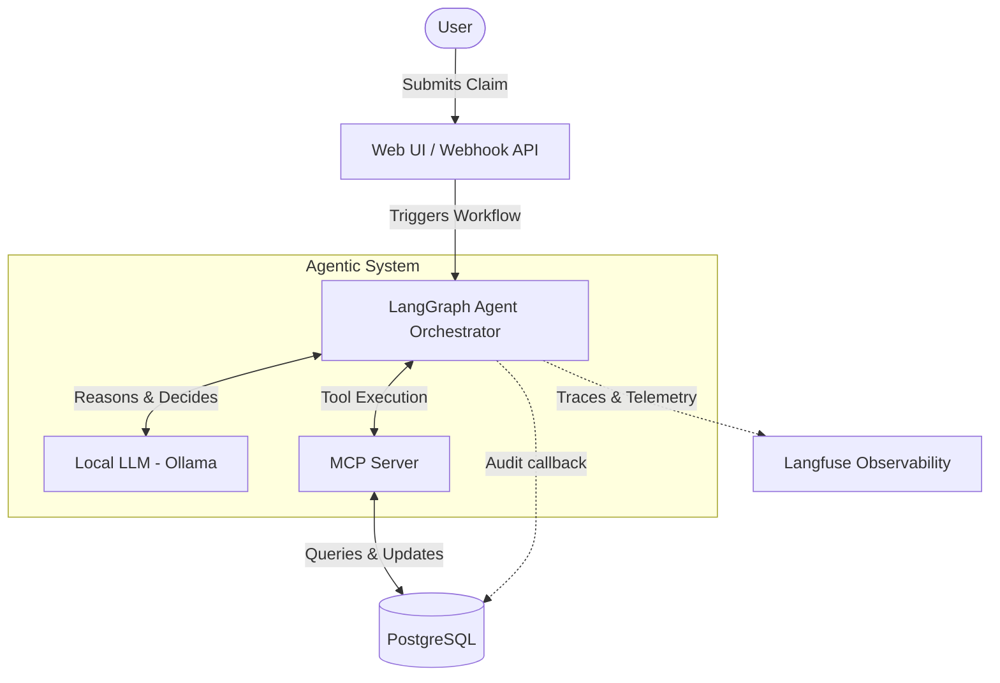

# Agentic Insurance Claim Orchestrator

The **Agentic Insurance Claim Orchestrator** is an enterprise-grade, AI-driven insurance claim resolution system. By leveraging local Large Language Models (LLMs), it fully automates the end-to-end claim adjudication process. 

The orchestrator utilizes **LangGraph** to coordinate multi-step reasoning workflows, allowing the AI to independently retrieve policy details, check coverage limits, and review flags. It connects to an immutable **PostgreSQL** database securely through the **Model Context Protocol (MCP)**, ensuring the LLM accesses and manipulates data via well-defined, safe tool interfaces. 

## Features
- **Automated Adjudication:** Fully automated claim triage and resolution using local LLMs (Ollama with Gemma2 or Llama3.1).
- **Secure Data Access:** Immutable PostgreSQL database exposed via standard MCP tools.
- **Agentic Workflow:** LangGraph.js implementation for cyclic reasoning and tool-use orchestration.
- **Interfaces:** JWT-secured Webhook API and simple Web UI for claim submission and monitoring.
- **Observability:** Comprehensive observability with Langfuse tracing.
- **Audit Trail:** Every node, LLM call and tool call of a claim run is written to an append-only `audit_logs` table (UPDATE/DELETE are rejected by a DB trigger) and exposed via `GET /claims/:id/audit`.

## Architecture Data Flow



## Setup Instructions

### Prerequisites
- [Docker & Docker Compose](https://docs.docker.com/get-docker/)
- [Node.js](https://nodejs.org/en/) (v20 or v22)
- [Ollama](https://ollama.com/) (running locally)

### 1. Environment Configuration
Copy the sample environment file and adjust the variables if necessary.
```bash
cp .env.example .env
```
Ensure Ollama is running locally and the appropriate model is pulled (e.g., `llama3.1` or `gemma2`).
```bash
ollama pull llama3.1
```

### 2. Run the Application using Docker Compose
The project uses Docker Compose to orchestrate the Node.js application, PostgreSQL database, and PgAdmin.
```bash
docker-compose up --build -d
```
*The API will be available at `http://localhost:3000` and PgAdmin at `http://localhost:5050`.*

### 3. Database Initialization (Optional)
If you need to seed the database manually, you can run the initialization scripts via npm. (The `app` container will connect to the `postgres` container on port 5432).
```bash
npm install
npm run build
npx ts-node src/db/schema.ts
npx ts-node src/db/seed.ts
```
*(You may also use `make db-seed` if configured in the Makefile).*

## Audit Trail
Each `POST /claim` run attaches an `AuditCallbackHandler` (`src/agent/callbacks/audit_callback.ts`) that records
`node_start`/`node_end`, `llm_start`/`llm_end` (messages and tool calls), `tool_start`/`tool_end` (tool name, input, output)
and `error` events into `audit_logs`. Writes are queued in event order, flushed before the HTTP response returns,
and never fail the claim (errors are only logged). Long strings in payloads are truncated.

```bash
curl -H "Authorization: Bearer $TOKEN" http://localhost:3000/claims/1/audit
# => { "claim_id": 1, "count": 8, "entries": [{ "step_index": 0, "event_type": "node_start", "node_name": "agent", "payload": {...}, ... }] }
```

## Future Improvements
- **Duplication Triage:** Automatically detect and triage duplicate claims (using vector similarity or SQL) to prevent double payouts.
- **Fraud Scoring:** Analyze claims for potential fraud using ML heuristics or 3rd-party risk assessment APIs before auto-approving them.
